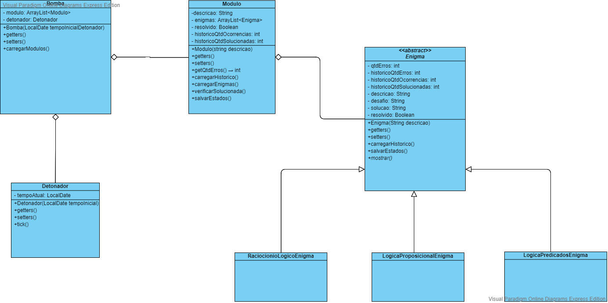
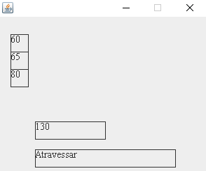
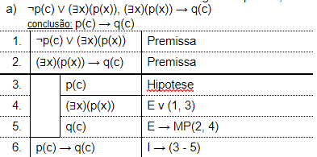

# Trabalho Final Programação Orientada a Objetos
Implementação do jogo **Keep talking and nobody explodes**, onde os desafios do jogo consistem em enigmas de **Raciocínio Lógico** e **Lógica de Predicados**.

#### Participantes:
* Vinícius Manuel Martins
* Gustavo Henrique Kistner
* Evandro Geliar Michels

#### Marcos:
1. [Modelo das classes / Lista dos conhecimentos a serem desenvolvidos / Enigmas prévios](#marco-1)
2. [Protótipos de interface e interação com a bomba / Enigmas completos](#marco-2)
3. [Protótipos de interface / Programação dos enigmas](#marco-3)
4. [Entrega do trabalho](#marco-4)

# Marco 1
* Modelo das classes: 

* Conhecimentos a se adquirir:
  1. Biblioteca gráfica 2D
  2. Ler e escrever em arquivos

* Enigmas prévios:
  * Raciocínio lógico: Iremos desenvolver uma questão onde o usuário deverá resolver o enigma com base em interruptores, e no final compararemos o progresso alcançado pelo usuário com as respostas da questão.
  * Lógica proposicional: Iremos desenvolver uma questão onde o usuário deverá resolver o enigma com pequenas pequenas respostas em sequência, onde no final irá formar a resposta para a questão.

# Marco 2
**Enigmas:**
* Raciocinío lógico:
  * 
  * Três pessoas com 60kg, 65kg e 80kg querem atravessar um rio. Entretanto o barco suporta no máximo 130kg. Atravesse o rio de modo que o barco não afunde.
* Lógica:
  * 

# Marco 3
**TODO**

# Marco 4
Trabalho finalizado e adicionado em pasta a parte: TrabalhoFinalizado, possui os .jar e os JSONs. 
